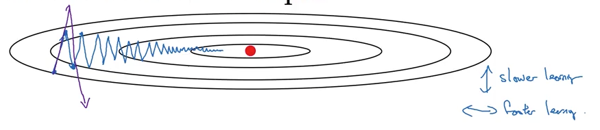

# Mini-batch gradient descent

With a deep network and tons of data, training could be very slow. Mini-batch gradient descent is a technique to speed this up.

Instead of using the entire training set for one pass through the gradient descent, a mini-batch is used. For example, if a training set has size $m = 1,000,000$ and a mini-batch size of 1000, a single pass through gradient descent (i.e. 1 epoch) would process 5,000 batches of data and update the parameters 5,000 times.

The extreme version of mini-batch gradient descent is stochastic gradient descent, in which the batch size is 1. This means that the update happens after processing every sample.

Mini-batch gradient descent is noisier but faster than normal gradient descent.

Typical mini-batch size of power of 2.

Pseudo-code for 5000 mini-batches of size 1000 each

```
  for _ in max_iter:
    for t=1 , 2 , ... 5000
      forward prop on X_t
      backward prop on X_t
      update parameters for X_t
```

# Exponentially weighted averages

Let the moving average of a given day $V_t = \beta V_{t-1} + (1- \beta) \theta_t$, where:

- $V_t$ is today's weighted average
- $V_t$ is yesterday's weighted average
- $\beta$ is the coefficient
- $\theta_t$ is today's value

$V_t$ approximates average over the last $\frac{1}{1-\beta}$ days' temperature. The bigger $\beta$ is, the more weight we give to previous values over today's value.


The red line represents the weighted averages for $\beta = 0.9$ (10 days).
The green line represents the weighted averages for $\beta = 0.98$ (50 days).

## Bias correction

We might apply a bias correction to account for the fact that the average is biased toward the current value in the beginning (where $V_{t-1}$ is very small)

We adjust $V_t = \frac{V_t}{1 - \beta^t}$. When $t$ is large, the denominator approaches 1, so there is almost no difference. When $t$ is small, it will be a weighted average of all the $\theta$s.

In practice, people don't generally bother with bias correction.

# Gradient Descent with momentum

We can use exponentially weighted average to optimize gradient descent:

On iteration t:
  - Compute $\delta W, \delta b$ on current mini-batch
  - $V_{dw} = \beta V_{\delta W} + (1-\beta) \delta W$
  - $V_{db} = \beta V_{\delta b} + (1-\beta) \delta b$
  - $W = W - \alpha V_{\delta W}$
  - $b = b - \alpha V_{\delta b}$

We can think of the $V_{\delta}$ as velocity and $\delta W$ term as the acceleration. If there is a clear direction toward the minima, we want gradient descent to accelerate in that direction. If not, then we want it to proceed slower as to not diverge.



In this example, we want more acceleration along the x-axis and less acceleration along the y-axis. The weighted average for the x-axis would become bigger and bigger with each iteration because gradient descent is moving in the same direction, whereas the weighted average for the y-axis would be small because gradient descent would oscillate around 0.

0.9 is a common choice for $\beta$ in deep learning.

# RMSprop

RMSprop is another way to optimize gradient descent with exponentially weighted average.

This difference is that the gradient terms are squared

On iteration t:
- Compute $\delta W, \delta b$ on current mini-batch
- $S_{dw} = \beta_2 V_{\delta W} + (1-\beta_2) \delta W^2$
- $S_{db} = \beta_2 V_{\delta b} + (1-\beta_2) \delta b^2$
- $W = W - \alpha \frac{dW}{\sqrt{S_{\delta W}} + \epsilon}$
- $b = W - \alpha \frac{dB}{\sqrt{S_{\delta b}} + \epsilon}$

The squared terms dampen out the oscillations associated with mini-batch gradient descents and allows us to use a larger learning rate while avoiding the risk of diverging.

# Adam Optimization

Adam optimization is a combination of momentum and RMSprop:

We have:
- Calculate uncorrected momentum values
- Calculate corrected momentum values
- Calculate RMSprop
- Adjust the weights

Pseudo-code:

- $V_{dw} = \beta_1 V_{\delta W} + (1-\beta_1) \delta W$
- $V_{db} = \beta_1 V_{\delta b} + (1-\beta_1) \delta b$
- $V_{dw}^{corrected} = \frac{V_{dw}}{1 - \beta_1^t}$
- $V_{db}^{corrected} = \frac{V_{db}}{1 - \beta_1^t}$
- $S_{dw} = \beta_2 V_{\delta W} + (1-\beta_2) \delta W^2$
- $S_{db} = \beta_2 V_{\delta b} + (1-\beta_2) \delta b^2$
- $W = W - \alpha \frac{V_{dw}^{corrected}}{\sqrt{S_{\delta W}} + \epsilon}$
- $b = W - \alpha \frac{V_{db}^{corrected}}{\sqrt{S_{\delta b}} + \epsilon}$

Hyper-parameters:
- $\alpha$: tuned
- $\beta_1$: .9
- $\beta_2$: .999
- $\epsilon$: $10^{-8}$

# Quiz

Which notation would you use to denote the 3rd layer’s activations when the input is the 7th example from the 8th minibatch?

- $a^{[3]\{8\}(7)}$

Which of these statements about mini-batch gradient descent do you agree with?

- One iteration of mini-batch gradient descent (computing on a single mini-batch) is faster than one iteration of batch gradient descent.

Why is the best mini-batch size usually not 1 and not m, but instead something in-between?

- If the mini-batch size is 1, you lose the benefits of vectorization across examples in the mini-batch.
- If the mini-batch size is m, you end up with batch gradient descent, which has to process the whole training set before making progress.

Suppose your learning algorithm’s cost J, plotted as a function of the number of iterations, looks like this:


- If you’re using mini-batch gradient descent, this looks acceptable. But if you’re using batch gradient descent, something is wrong.

Suppose the temperature in Casablanca over the first three days of January are the same:

Jan 1: $\theta_1 = 10^C$
Jan 2: $\theta_2 = 10^C$
(We used Fahrenheit in lecture, so will use Celsius here in honor of the metric world.)

Say you use an exponentially weighted average with $\beta=0.5$. If v2 is the value computed after day 2 without bias correction, and vcorrected2 is the value you compute with bias correction. What are these values? (You might be able to do this without a calculator, but you don't actually need one. Remember what is bias correction doing.)

- $v_2=7.5, v^{corrected}_2=10$

Which of these is NOT a good learning rate decay scheme? Here, t is the epoch number.

- $\alpha = e^t * \alpha_0$, because we want $\alpha$ to decrease with iterations.

You use an exponentially weighted average on the London temperature dataset. You use the following to track the temperature: $v_t = \beta v_{t-1} + (1 - \beta) \theta_t$. The red line below was computed using $\beta = 0.9$. What would happen to your red curve as you vary β? (Check the two that apply)


- Increasing $\beta$ will shift the red line slightly to the right because it takes into consideration more of the previous values, which are smaller.
- Decreasing $\beta$ will create more oscillation within the red line because it will take into consideration more of the current values, which create more abrupt changes.

These plots were generated with gradient descent; with gradient descent with momentum (β = 0.5) and gradient descent with momentum (β = 0.9). Which curve corresponds to which algorithm?


- (1) is gradient descent.
- (2) is gradient descent with momentum (small $\beta$). small $\beta$ should see more oscillation than larger $\beta$ because it takes into consideration less of the previous values.
- (3) is gradient descent with momentum (large $\beta$)

Suppose batch gradient descent in a deep network is taking excessively long to find a value of the parameters that achieves a small value for the cost function $J$. Which of the following techniques could help find parameter values that attain a small value for $J$? (Check all that apply)

- Try better random initialization for the weights
- Try mini-batch gradient descent
- Try tuning the learning rate
- Try using Adam

Which of the following statements about Adam is False?
- Adam should be used with batch gradient computations, not with mini-batches.
